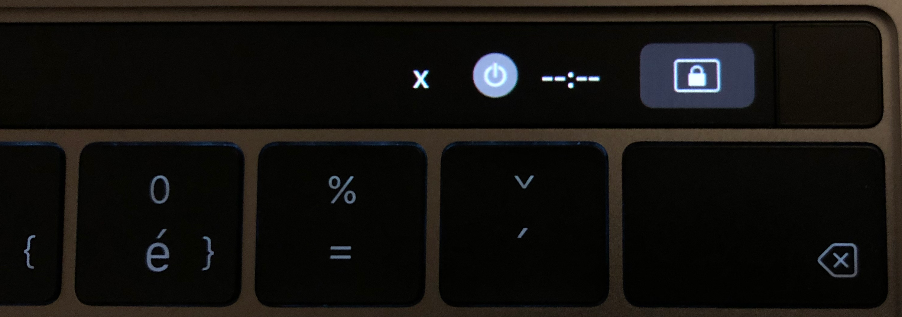

# Toggl script for BTT

## Install
Just run `npm install -g btt-toggl` it will ask for your API token to communicate with the Toggl API. 

## Functionality

The widget will display if there is any running task on Toggl. When clicked it will toggl the state (stop or start new task).

### Active state

### Inactive state
